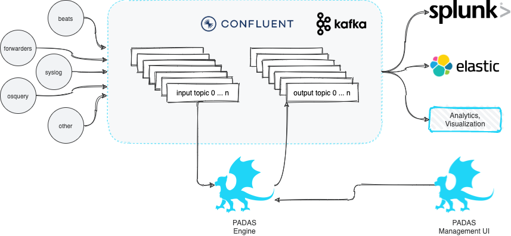

### What is PADAS?
--8<-- "whatispadas.md"
 

---

### Components
Padas has 2 main components:

1. **Manager UI**: All configuration changes (CRUD - Create, Read, Update, Delete operations) can be performed through Manager web interface.  This is an optional but recommended component to manage configurations through Engine API.
2. **Engine**: Reads configurations from existing Padas namespaces (local or topics) and runs assigned (based on `group` setting) and enabled topologies.  Each topology reads from a single source topic, runs one or more pipeline(s), and writes the resulting outputs to one or more output topic(s).  Each pipeline consists of one or more task(s) where each task can perform a filter, transform, enrichment, or detection (rules) function.  Engine components can be scaled up or down as needed with group assignments to distribute work-load.  Please see below for details on concepts.

<figure markdown>
  

  
  

</figure>

### Basic Concepts
Let's take a closer look at Padas configuration and engine's processing concepts.  At a high-level, Padas Engine reads an input topic, processes data (pipelines and tasks) and writes to one or more output topics.

<figure markdown>
  

  
  

</figure>

#### Topology

--8<-- "description/description_topology.md"

#### Pipeline

--8<-- "description/description_pipeline.md"

#### Task

--8<-- "description/description_task.md"

#### Rule

--8<-- "description/description_rule.md"