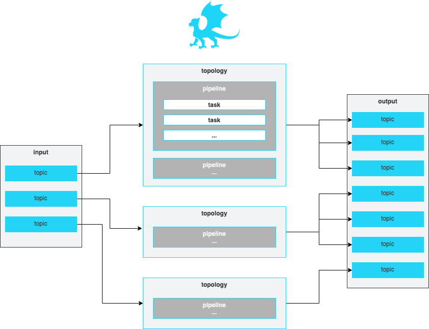

This guide provides information on Padas User Interface menu and configuration items.

## Streaming Configurations
Following sections describe how to configure Padas to run streaming tasks in order to transform events and/or apply a set of filtering rules to generate alerts.  Please refer to [Introduction](introduction.md) before moving forward in order to understand engins'e processing concepts.

<figure markdown>
  

  
  

</figure>

All of the configuration views (Topologies, Pipelines, Tasks, Rules) provide the ability to bulk upload or download configurations in JSON format.

<figure markdown>
  

  
  

</figure>

---

### Topologies

--8<-- "description_topology.md"

<figure markdown>
  

  
  

</figure>

--8<-- "props_topology.md"

---

### Pipelines

--8<-- "description_pipeline.md"

<figure markdown>
  

  
  

</figure>

--8<-- "props_pipeline.md"

---

### Tasks

--8<-- "description_task.md"

<figure markdown>
  

  
  

</figure>

--8<-- "props_task.md"

---

### Rules

--8<-- "description_rule.md"

<figure markdown>
  

  
  

</figure>

--8<-- "props_rule.md"

---

### Test

Test view allows a simple interface to play with sample data and verify configurations.

--8<-- "props_test.md"

---

---

## Management Configurations

### Users
As an administrator user, you can view and edit all configuration items including user account settings. Currently there are 2 roles available for a user: `admin` and `user`, where `user` has read-only access to configurations.  "Users" view can be accessed via "Settings --> Users" menu.

<figure markdown>
  

  
  

</figure>

---

### Nodes
Node Information table provides details on registered Padas engine instances.

<figure markdown>
  

  
  

</figure>

--8<-- "props_node.md"

---

### Topics

Topics view displays information on required Padas topics for storing configuration items.  Details can be found in [Topic Properties](admin-guide.md#topic-properties) section in Admin Guide.

<figure markdown>
  

  
  

</figure>

---

